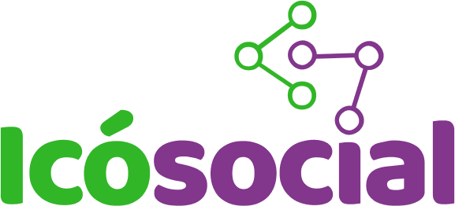
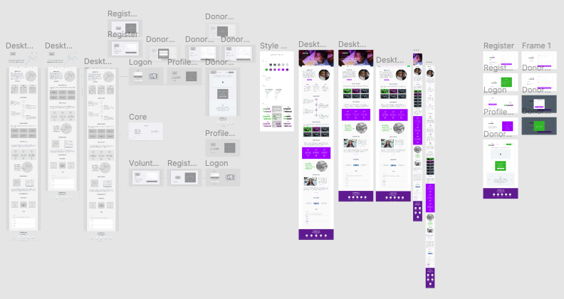

<h1 align="center">
    
</h1>

<h4 align="center">
  <strong>Icósocial Website</strong>
</h4>

  

  

  <a href="#floppy_disk-technology">Technology</a>&nbsp;&nbsp;&nbsp;|&nbsp;&nbsp;&nbsp;
  <a href="#computer-project">Project</a>&nbsp;&nbsp;&nbsp;|&nbsp;&nbsp;&nbsp;
  <a href="#family_man_man_boy_boy-contribute">Contribute</a>&nbsp;&nbsp;&nbsp;|&nbsp;&nbsp;&nbsp;
  <a href="#memo-license">License</a>&nbsp;&nbsp;&nbsp;|&nbsp;&nbsp;&nbsp;
  <a href="#blue_heart-contributors">Contributors</a>

 

<strong>Icósocial</strong> Icósocial is an NGO (Non-Governmental Organization) that serves people (children and their guardians) offering language classes, sports, music and other classes in addition to offering social benefits such as clothing bazaar and donations of basic food baskets.

## :floppy_disk: Technology

This project was developed with the following technologies:

<ul>
  <li><a href="https://sass-lang.com/">JavaScript</a></li>
  <li><a href="https://developer.mozilla.org/en-US/docs/Web/HTML">HTML</a></li>
  <li><a href="https://facebook.github.io/jsx/">JSX</a></li>
  <li><a href="https://sass-lang.com/">Sass</a></li>
  <li><a href="https://reactjs.org/">ReactJs</a></li>
  <li><a href="https://reacttraining.com/react-router/">React Router DOM</a></li>
  <li><a href="https://fullpage.caferati.me/">React Awesome Slider</a></li>
  <li><a href="https://www.npmjs.com/package/react-toasts">React Toasts</a></li>
  <li><a href="https://react-icons.github.io/react-icons/">React Icons</a></li>
  <li><a href="https://prettier.io/">Prettier</a></li>
  <li><a href="https://eslint.org/">EsLint</a></li>
  <li><a href="https://babeljs.io/">Babel</a></li>
  <li><a href="https://webpack.js.org/">Webpack</a></li>
</ul>

## :computer: Project

As it is a non-governmental organization (NGO), and offers free services for the benefit of the community, the Icósocial needs the disclosure of the institution, publishing the services offered, and adding sponsoring partners to meet any demand for financial resources that guarantee functionality and effectiveness of the services offered.
 
The objective of this project was to develop a web product that benefits a social project. The product is a responsive SPA, which can gradually add functionality. The application will initially present the institution and services offered by it, and disclose the transparency and functionality of the social project. Having features to register volunteers, partners and enable ways of contributing to these maintainers.
 
<a href="https://www.figma.com/file/4gsTecyjeHu1C445GwzWdN/Ic%C3%B3social-SPA">Clicking here</a> it is possible to check the design work developed in Figma, low and high fidelity prototype:

    

 
<strong>Project Web</strong>
 

 
<strong>Project Web</strong>
 

#### 🔢 Commands

##### **`yarn start`**
>Runs the app in the development mode.
>Open http://localhost:3000 to view it in the browser.
>
>The page will reload if you make edits.
>You will also see any lint errors in the console.

##### **`yarn test`**
>Launches the test runner in the interactive watch mode.
>See the section about [running tests](https://create-react-app.dev/docs/running-tests/) for more information.

##### **`yarn build`**
>Builds the app for production to the `build` folder.
>It correctly bundles React in production mode and optimizes the build for the best performance.
>
>The build is minified and the filenames include the hashes.
>Your app is ready to be deployed!

>See the section about [deployment](https://create-react-app.dev/docs/deployment/) for more information.

##### **`yarn eject`**
>**Note: this is a one-way operation. Once you `eject`, you can’t go back!**
>
>If you aren’t satisfied with the build tool and configuration choices, you can `eject` at any time. This command will remove the single build dependency from your project.
>
>Instead, it will copy all the configuration files and the transitive dependencies (webpack, Babel, ESLint, etc) right into your project so you have full control over them. All of the commands except `eject` will still work, but they will point to the copied scripts so you can tweak them. At this point you’re on your own.
>
>You don’t have to ever use `eject`. The curated feature set is suitable for small and middle deployments, and you shouldn’t feel obligated to use this feature. However we understand that this tool wouldn’t be useful if you couldn’t customize it when you are ready for it.

## :family_man_man_boy_boy: Contribute

To contribute, <a href="CONTRIBUTING.md">follow these instructions</a>.

## :memo: License

This project is under the MIT license. See the file <a href="LICENSE.md">LICENSE</a> for more details.

## :purple_heart: Contributors

<table>
  <tr>
    <td align="center" style="border: none;">
      <a href="https://github.com/alinecbsr">
        
         
        
          <b>Aline Rosa</b>
        
      </a>
       
      
<scan title="Code">💻</scan>|<scan title="Documentation">🎨</scan>|<scan title="Bugs">🐛</scan>

    </td>
        <td align="center" style="border: none;">
      <a href="https://github.com/wwwgomes">
        
         
        
          <b>Williams Gomes</b>
        
      </a>
       
      
<scan title="Code">💻</scan>|<scan title="Documentation">📖</scan>|<scan title="Bugs">🐛</scan>

    </td>
    <td align="center" style="border: none;">
      <a href="https://github.com/Marianasn4">
        
         
        
          <b>Mariana Nascimento</b>
        
      </a>
       
      
<scan title="Code">💻</scan>|<scan title="Documentation">🎨</scan>

    </td>
    <td align="center" style="border: none;">
      <a href="https://github.com/tteuh">
        
         
        
          <b>Matheus Lima</b>
        
      </a>
       
      
<scan title="Code">💻</scan>

    </td>
  </tr>
</table>
